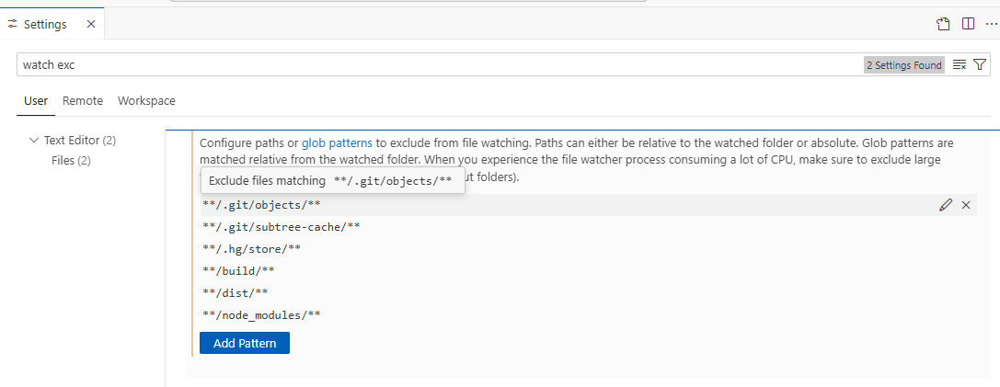

## Learn More

https://github.com/SAP/business-document-processing/blob/main/doc_inf_ext_exercises/README.md

Learn more at https://cap.cloud.sap/docs/get-started/.

https://www.google.com/search?q=trigger+sap+capm+action+with+parameters+uisng+odata+v4+model+from+sap+fiori+app+%2B+example&sca_esv=8ff73cc9fbbf5111&ei=PAU4aYKVMruiseMP2aXjqAE&ved=0ahUKEwiCo63vsLCRAxU7UWwGHdnSGBUQ4dUDCBE&uact=5&oq=trigger+sap+capm+action+with+parameters+uisng+odata+v4+model+from+sap+fiori+app+%2B+example&gs_lp=Egxnd3Mtd2l6LXNlcnAiWXRyaWdnZXIgc2FwIGNhcG0gYWN0aW9uIHdpdGggcGFyYW1ldGVycyB1aXNuZyBvZGF0YSB2NCBtb2RlbCBmcm9tIHNhcCBmaW9yaSBhcHAgKyBleGFtcGxlSNoGUABY7ANwAHgBkAEAmAGzAaABywKqAQMwLjK4AQPIAQD4AQGYAgCgAgCYAwDiAwUSATEgQJIHAKAHzAayBwC4BwDCBwDIBwCACAA&sclient=gws-wiz-serp

### uncaughtException: ENOSPC: System limit for number of file watchers reached + sap capm

https://github.com/SAP-samples/cap-hana-exercises-codejam/blob/main/

https://community.sap.com/t5/technology-blog-posts-by-members/developing-cap-based-fiori-app-draft-enabled-with-node-js-and-vscode/ba-p/13551654

https://github.com/SAP-samples/fiori-elements-feature-showcase

[text](../sapui5-development-learning-journey)

<List
		items="{/ProductCollection}"
		headerText="Products">
		<ObjectListItem
			title="{Name}"
			type="Active"
			press="onListItemPress"
			number="{
				parts:[{path:'Price'},{path:'CurrencyCode'}],
				type: 'sap.ui.model.type.Currency',
				formatOptions: {showMeasure: false}
			}"
			numberUnit="{CurrencyCode}">
			<firstStatus>
				<ObjectStatus
					text="{Status}"
					state="{
						path: 'Status',
						formatter: '.formatter.status'
					}" />
			</firstStatus>
			<ObjectAttribute text="{WeightMeasure} {WeightUnit}" />
			<ObjectAttribute text="{Width} x {Depth} x {Height} {DimUnit}" />
		</ObjectListItem>
	</List>
