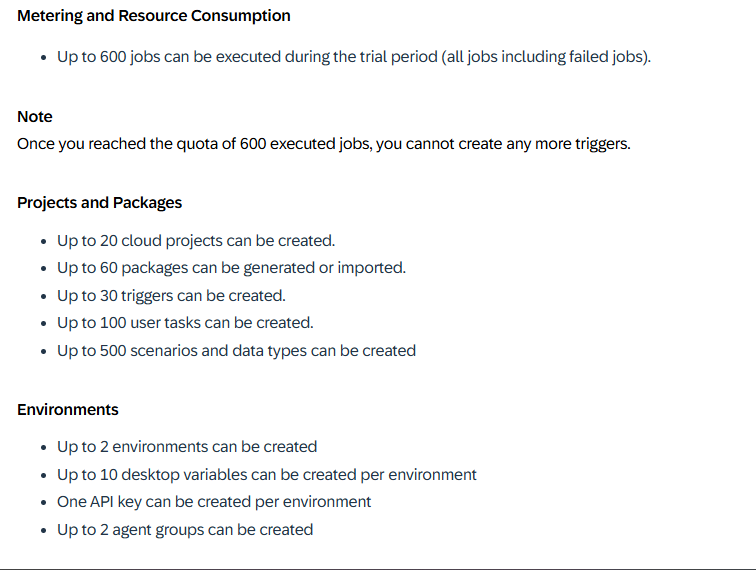

# Getting Started

Welcome to your new project.

It contains these folders and files, following our recommended project layout:

File or Folder | Purpose
---------|----------
`app/` | content for UI frontends goes here
`db/` | your domain models and data go here
`srv/` | your service models and code go here
`package.json` | project metadata and configuration
`readme.md` | this getting started guide

## Next Steps

- Open a new terminal and run `cds watch`
- (in VS Code simply choose _**Terminal** > Run Task > cds watch_)
- Start adding content, for example, a [db/schema.cds](db/schema.cds).

## Learn More

Learn more at https://cap.cloud.sap/docs/get-started/.

https://www.google.com/search?q=trigger+sap+capm+action+with+parameters+uisng+odata+v4+model+from+sap+fiori+app+%2B+example&sca_esv=8ff73cc9fbbf5111&ei=PAU4aYKVMruiseMP2aXjqAE&ved=0ahUKEwiCo63vsLCRAxU7UWwGHdnSGBUQ4dUDCBE&uact=5&oq=trigger+sap+capm+action+with+parameters+uisng+odata+v4+model+from+sap+fiori+app+%2B+example&gs_lp=Egxnd3Mtd2l6LXNlcnAiWXRyaWdnZXIgc2FwIGNhcG0gYWN0aW9uIHdpdGggcGFyYW1ldGVycyB1aXNuZyBvZGF0YSB2NCBtb2RlbCBmcm9tIHNhcCBmaW9yaSBhcHAgKyBleGFtcGxlSNoGUABY7ANwAHgBkAEAmAGzAaABywKqAQMwLjK4AQPIAQD4AQGYAgCgAgCYAwDiAwUSATEgQJIHAKAHzAayBwC4BwDCBwDIBwCACAA&sclient=gws-wiz-serp

